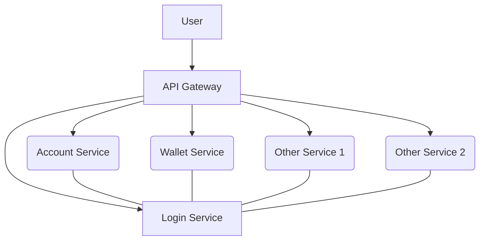
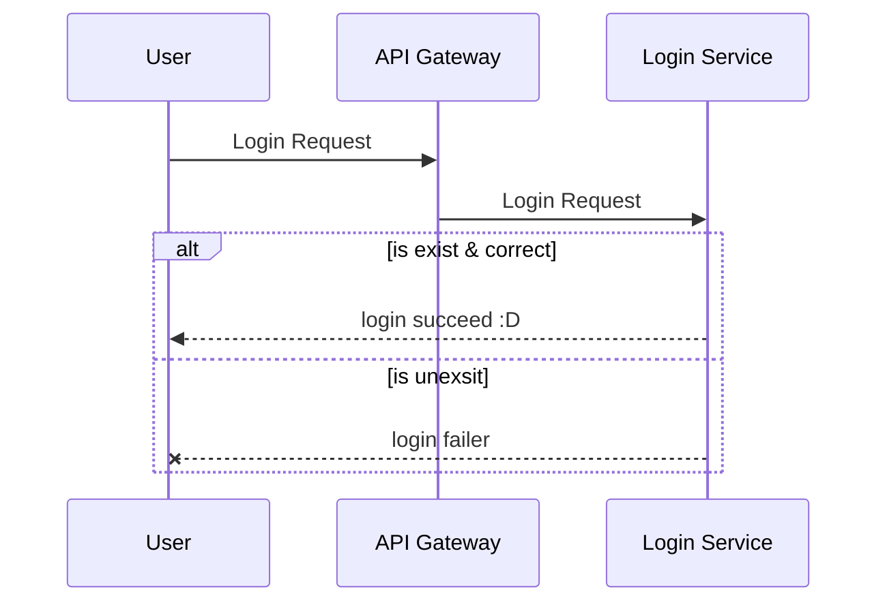
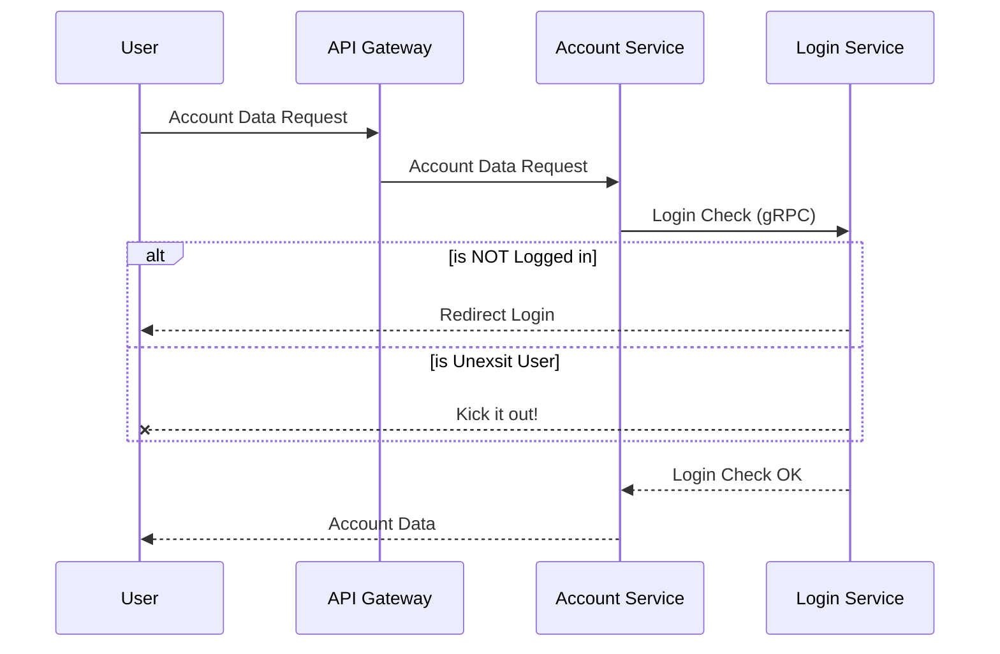
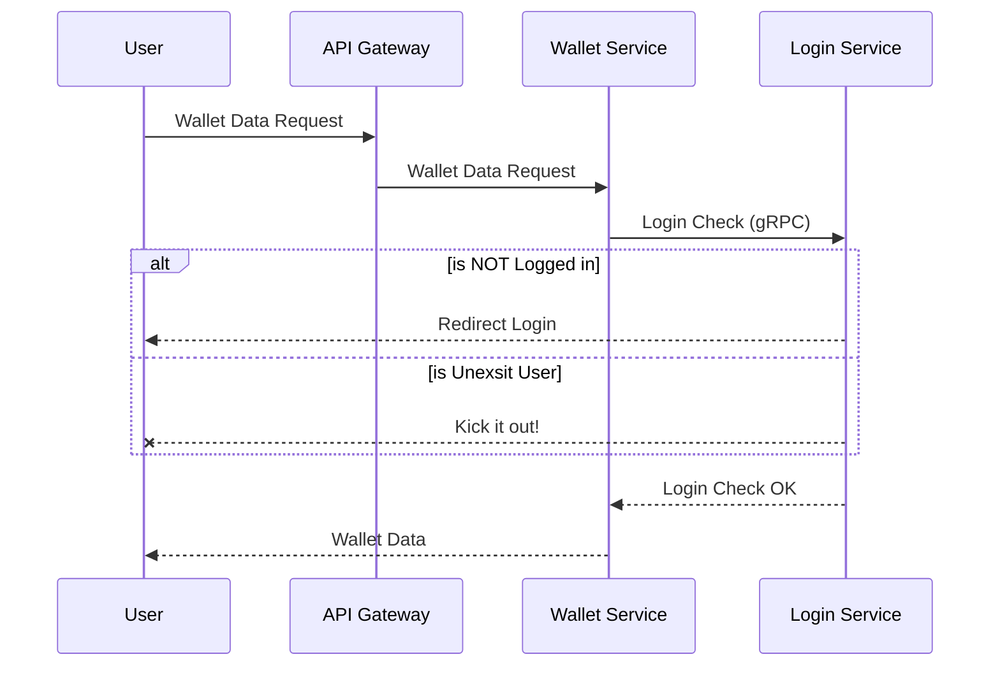

# Microservices Architecture
Microservices の基本構成図と基本フローを記述します。

このページは [StackEditor](https://stackedit.io/) で作成されています。

## 基本構成図
Microservices の基本構成図。User は API Gateway を通じてアクセス、明示的なログイン（ログアウト）リクエスト以外は各サービスが一旦リクエストを受け取り、内部的に gRPC で Login Service に問い合わせ、ログイン状態かどうかを確認した上で、各サービスを継続するかどうかを決定する。

## 基本シーケンス
このセクションでは基本シーケンスを記載します。

### ログイン（Login）

### アカウント（Account）

### ウォレット（Wallet）

<!--stackedit_data:
eyJoaXN0b3J5IjpbLTIxMjM5OTc0MDMsNDQ1OTYxOTQ4LDE1ND
YwMzExMDFdfQ==
-->